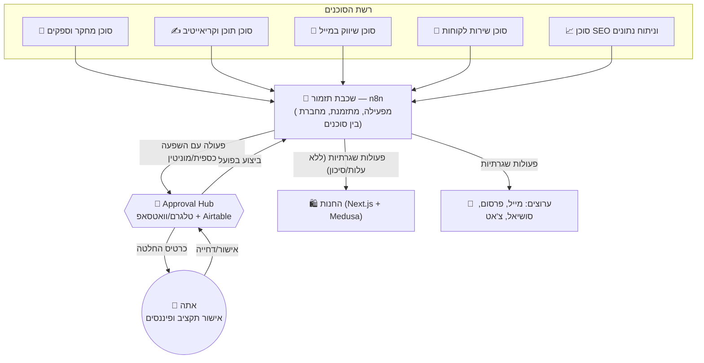

# ארכיטקטורת מערכת ה-AI Agents — חנות הדרופשיפינג האוטומטית

> מסמך זה מגדיר את הארכיטקטורה המלאה של רשת סוכני ה-AI, שכבת התזמור, ופלטפורמת החנות.
> עקרון־העל: **Maximum Automation, Minimum Human Touch** — כל תהליך תפעולי, תוכן ושיווק מנוהל ע"י סוכנים אוטונומיים; המעורבות האנושית מצטמצמת לנקודת אישור אחת מרוכזת (תקציב/כסף/מוצר חדש) ולא מפוזרת בין עשרות כלים.

---

## 1. עקרון העיצוב המרכזי: שער אישור אחד (Single Approval Gate)

הבעיה הנפוצה ב"אוטומציה מקסימלית" היא שהיא בדרך כלל לא באמת מקסימלית — הבעלים עדיין צריך להיכנס ל-10 מערכות שונות כדי לאשר דברים. הפתרון הארכיטקטוני כאן:

- כל סוכן יכול **לפעול ללא אישור** בתחום שהוגדר לו כ"בטוח" (תוכן אורגני, תשובות שירות שגרתיות, אופטימיזציית SEO).
- כל פעולה שיש לה **השפעה כספית או מוניטינית** (הוצאת כסף על מודעות/ספק, הוספת מוצר חדש, מענה ללקוח כועס) עוברת דרך **Approval Hub** מרכזי אחד — בוט טלגרם/וואטסאפ (או Airtable) ששולח לך כרטיס החלטה יחיד עם כפתורי אישור/דחייה.
- זה נותן לך בדיוק את התפקיד שביקשת: **מאשר תקציבים ומנהל פיננסים**, לא "מפעיל תוכנה".

---

## 2. שכבת התזמור (Orchestration Layer)

### 2.1 המלצה: n8n כמנוע התזמור המרכזי

| קריטריון | n8n | CrewAI / AutoGen (Python) | Make / Zapier |
|---|---|---|---|
| נראות ותחזוקה ע"י לא-מפתח | גבוהה — ממשק ויזואלי | נמוכה — דורש קוד | גבוהה |
| שערי אישור אנושי מובנים (Wait/Approval nodes) | ✅ מובנה | דורש בנייה ידנית | חלקי |
| עלות בקנה מידה (כמות ריצות) | נמוכה (self-host) / סבירה (cloud) | תלוי בתשתית שתריץ | **יקר מאוד בסקייל** |
| חיבור לכל API (Medusa, Stripe, Klaviyo, Meta Ads, WhatsApp) | מצוין, קהילה ענקית | ידני | טוב אך מוגבל בלוגיקה מורכבת |
| התאמה ל"סוכנים אוטונומיים משוחחים זה עם זה" | בינונית (workflow-based) | **מצוין** — זה בדיוק הייעוד שלו | חלשה |

**החלטה:** מתחילים עם **n8n** כעמוד השדרה התפעולי — כי הוא נותן לך את שני הדברים הכי חשובים בשלב הזה: שקיפות מלאה (אתה יכול *לראות* מה כל סוכן עושה) ושערי אישור מובנים. **CrewAI** מוצג כשלב הבא (Phase 5) לכשנרצה שהסוכנים "ידברו זה עם זה" בלי איש תיווך אנושי בלולאה (למשל: סוכן המחקר מגלה מוצר → מעביר ישירות לסוכן התוכן → זה מייצר קריאייטיב → הכול קורה בשיחה אוטונומית בין הסוכנים, לא רק כשרשרת שלבים).

### 2.2 "המוח" של כל סוכן: Claude API

כל סוכן הוא בפועל: **קריאת API ל-Claude עם system prompt ייעודי + כלים (tools) ספציפיים לתפקידו**, המופעלת מתוך n8n (HTTP Request node / n8n's native AI Agent node). כלומר אין צורך ב"5 מוצרי AI שונים" — יש מודל אחד, עם 5 "כובעים" (system prompts) שונים וגישה לכלים שונים.

### 2.3 Approval Hub — המימוש הטכני

בוט טלגרם קליל (או קבוצת WhatsApp Business API) המחובר ל-n8n:
1. סוכן מזהה פעולה שדורשת אישור → n8n שולח הודעה לבוט עם פרטי ההחלטה + 2 כפתורים (✅ אשר / ❌ דחה).
2. אתה מגיב מהנייד תוך שניות.
3. n8n ממשיך את ה-workflow בהתאם לתשובה.
4. כל ההחלטות נרשמות אוטומטית ל-Airtable/Google Sheets כ"יומן החלטות" — כדי שתוכל לראות תמונה פיננסית מלאה בכל רגע.

דוגמאות לפעולות שעוברות דרך ה-Hub: אישור מוצר חדש לעלייה לחנות, הגדלת תקציב מודעות, תשלום לספק מעל סכום סף, מענה ללקוח שסימן "תלונה/החזר כספי".

---

## 3. חמשת הסוכנים

### 3.1 🔎 סוכן מחקר וספקים (Research & Suppliers Agent)

- **תפקיד:** איתור מוצרים ויראליים/טרנדיים, בדיקת ספקים, חישוב מרווח רווח פוטנציאלי.
- **קלט (מקורות נתונים):** Google Trends, TikTok Creative Center (Trending Products/Hashtags), Meta Ad Library (אילו מודעות דרופשיפינג רצות הכי הרבה זמן — סימן להצלחה), AliExpress/CJ Dropshipping/Zendrop/Spocket (מלאי, מחיר, זמני משלוח, ביקורות), ניתוח חנויות מתחרות (Apify/Bright Data scraping).
- **פלט:** "דו״ח הזדמנויות מוצר" שבועי — טבלה של 5-10 מוצרים מדורגים לפי: מהירות מגמה, מרווח רווח, רמת תחרות, אמינות ספק, זמן משלוח.
- **שער אישור:** **כן — תמיד.** הוספת מוצר חדש = החלטה עסקית, עוברת ל-Approval Hub עם כל הנתונים לקבלת החלטה מהירה.
- **קצב:** ריצה אוטומטית שבועית (ניתן להריץ גם "לפי דרישה").

### 3.2 ✍️ סוכן תוכן וקריאייטיב (Content & Creative Agent)

- **תפקיד:** תיאורי מוצר ממירים, פוסטים לרשתות, תסריטים לסרטוני TikTok/Reels, פרומפטים ליצירת ויזואליה (ר' [אסטרטגיית שיווק](marketing-strategy.md)).
- **קלט:** נתוני המוצר שאושר, brand voice guide (מוגדר פעם אחת), טרנדים עדכניים מסוכן המחקר.
- **פלט:** דף מוצר מלא (כותרת, תיאור, bullet points, FAQ), 7 פוסטים שבועיים לסושיאל, 2-3 תסריטי וידאו לשבוע, פרומפטים מוכנים ל-Midjourney/Runway.
- **שער אישור:** תוכן אורגני שגרתי (פוסטים, תיאורי מוצר) — **אוטומטי לחלוטין**, ללא אישור. קריאייטיב לפרסום ממומן (כי יש עלות מדיה מאחוריו) — עובר עם תקציב המודעה דרך ה-Approval Hub.
- **קצב:** רציף/יומי לתוכן אורגני; per-campaign לפרסום ממומן.

### 3.3 📧 סוכן שיווק במייל (Email Marketing Agent)

- **תפקיד:** בניית וניהול רצפי מייל אוטומטיים ואופטימיזציה מתמשכת שלהם.
- **קלט:** נתוני התנהגות לקוח מ-Medusa (עגלה, רכישות, גלישה — נשלחים כ-webhook events), ביצועי מיילים קודמים.
- **פלט:** רצפי Flow קבועים — Welcome Series, עגלה נטושה (2-3 תזכורות), פוסט-רכישה/Upsell, Win-back ל-60 יום ללא רכישה, הצעות מותאמות אישית לפי היסטוריית קנייה. כולל A/B testing אוטומטי לשורת נושא ולקריאייטיב.
- **שער אישור:** הרצת flows שגרתית — **אוטומטי**. שינוי משמעותי במדיניות הנחות (למשל קופון 30%+) — עובר אישור.
- **כלים:** Klaviyo או Omnisend, מחוברים ל-Medusa דרך webhooks/n8n (אין כאן אינטגרציה מובנית כמו ב-Shopify, אז n8n הוא ה"דבק" שמעביר אירועי עגלה/הזמנה בזמן אמת).

### 3.4 💬 סוכן שירות לקוחות (Customer Service Agent)

- **תפקיד:** מענה אנושי ומדויק לפניות מייל/צ'אט/וואטסאפ — סטטוס הזמנה, מדיניות החזרות, שאלות מוצר.
- **קלט:** תוכן הפנייה, היסטוריית ההזמנה (Medusa Admin API), brand voice guide, מדיניות שירות.
- **פלט:** תשובה מוכנה. פניות שגרתיות (סטטוס משלוח, שאלה כללית) — **נשלחות אוטומטית**. פניות רגישות (תלונה, בקשת החזר כספי, טון עוין) — **מסומנות ומועברות ל-Approval Hub** עם תשובה מוצעת שאתה רק מאשר/עורך.
- **שלב חשוב:** בחודש הראשון מומלץ להתחיל עם **כל** התשובות במצב "טיוטה לאישור" (Human-in-the-loop מלא) עד שתרגיש בטוח באיכות ובטון — ואז בהדרגה לפתוח פניות שגרתיות לשליחה אוטומטית.
- **כלים:** Gorgias / Zendesk / Tidio, או ישירות WhatsApp Business API.

### 3.5 📈 סוכן SEO וניתוח נתונים (SEO & Analytics Agent)

- **תפקיד:** מחקר מילות מפתח, אופטימיזציה למנועי חיפוש, דו״ח ביצועים שבועי עם המלצות.
- **קלט:** Google Search Console, Google Analytics 4, Vercel Analytics, Meta/TikTok Ads Manager.
- **פלט:** תיקוני SEO טכניים (meta descriptions, alt text, מבנה URL) — מבוצעים אוטומטית; תוכן בלוג לתנועה אורגנית; דו״ח שבועי אחד מרוכז (KPI dashboard) עם 3-5 המלצות פעולה.
- **שער אישור:** תיקוני SEO קוסמטיים — **אוטומטי**. המלצה שמשמעה שינוי תקציב מודעות ("הגדל תקציב לקמפיין X ב-30% כי ה-ROAS מצוין") — עוברת ל-Approval Hub.

---

## 4. פלטפורמת החנות

### 4.1 החלטה: קוד מותאם אישית — Next.js + Medusa.js + Stripe

**עודכן:** ההחלטה המקורית המליצה על Shopify (הכי מהיר להשקה, אפס תחזוקת קוד). לבקשתך המפורשת עברנו לבנייה עצמית, כדי לקבל שליטה עיצובית וטכנית מלאה על החנות. חשוב להבין את המחיר של הבחירה הזו לפני שממשיכים:

| קריטריון | Shopify (לא נבחר) | **Next.js + Medusa (נבחר)** | WooCommerce |
|---|---|---|---|
| זמן להשקה | ימים | **שבועות** (יש הרבה יותר לבנות) | שבוע-שבועיים |
| תשלומים/PCI compliance | פתור מובנה | **Stripe** (לא בונים סליקה בעצמכם — אף אחד לא עושה את זה, גם באתרים מותאמים) | תלוי בתוסף |
| אקוסיסטם אוטומציה מוכן | עצום, הכל כ-app | **צריך לחבר/לבנות בעצמכם** דרך n8n (יותר עבודת אינטגרציה לכל כלי) | טוב, מבוזר |
| תחזוקה שוטפת | אין — מנוהל | **יש** — עדכוני Next.js/Medusa, אירוח, ניטור שרתים | תלוי באחסון |
| התאמה ל"בעלים שרק מאשר תקציבים" | הכי מתאים | **דורש איתך (או ממני) מעורבות טכנית שוטפת יותר בהתחלה** | סביר |
| גמישות עיצובית וטכנית | טובה, לא אינסופית | **מלאה — כל פיקסל וכל התנהגות בשליטתכם** | טובה |
| עלות חודשית משוערת | ~$25-40 | אירוח Next.js (Vercel) + אירוח Medusa/DB + Stripe עמלות ≈ $20-60 | אחסון+תוספים |

**המשמעות המעשית:** הארכיטקטורה של 5 הסוכנים לא משתנה כלל — הם עדיין עובדים דרך n8n ו-Approval Hub אחד. מה שמשתנה הוא **כמה עבודת הנדסה יש בשכבת המסחר עצמה**: עם Shopify כל האינטגרציות (מלאי, הזמנות, מיילים) כבר קיימות כ-app מוכן; עם קוד מותאם אישית **אני אבנה** את שכבת ה-API שמחברת בין Next.js, Medusa ו-n8n — אבל זו עבודה אמיתית שתלקח מספר שבועות, לא ימים. שווה לדעת את זה מראש.

### 4.1.1 הרכיבים הטכניים

- **Next.js (App Router)** — חזית החנות (storefront): דף בית, דף מוצר, עגלה, checkout UI. מתארח ב-**Vercel**.
- **Medusa.js** — מנוע מסחר open-source (Node.js): קטלוג מוצרים, עגלה, ניהול הזמנות ומלאי, ו-**Admin API** שדרכו סוכן המחקר/התוכן יכולים ליצור מוצרים ולעדכן מלאי ישירות (זה מה שחוסך מאיתנו לבנות מסד נתונים ולוגיקת הזמנות מאפס). מתארח על Railway/Render (Postgres + Redis).
- **Stripe** — סליקה, PCI compliance, Apple Pay/Google Pay. מחובר גם ל-Medusa (plugin רשמי) וגם ישירות ל-Next.js checkout UI.
- כל שינוי (הזמנה חדשה, מוצר חדש, מלאי אזל) יוצא כ-webhook מ-Medusa אל n8n, שמפיץ אותו הלאה לסוכן הרלוונטי (מייל, שירות לקוחות, אנליטיקס).

### 4.2 מבנה החנות (ברמת התבנית)

- **דף בית:** באנר הירו עם המוצר/קולקציה המובילים, Social proof (ביקורות/UGC), USPs (משלוח, אחריות, החזרות), Trust badges.
- **דף מוצר:** גלריית תמונות/וידאו, כותרת ממירה, bullet points של יתרונות (לא רק specs), ביקורות, Upsell/Cross-sell ("קונים ביחד"), Sticky Add-to-Cart בנייד, Urgency element (מלאי מוגבל/משלוח מהיר) — **אמיתי בלבד, לא מזויף**.
- **עגלת קניות:** Drawer צד (לא מעבר עמוד), הצעת Upsell לפני checkout, חישוב משלוח שקוף.
- **Checkout:** נבנה עם Stripe Checkout/Elements בתוך Next.js, מותאם לחלוטין לעיצוב המותג (לא screen חיצוני כמו בפלטפורמות SaaS) — Apple Pay / Google Pay מופעלים כברירת מחדל להורדת חיכוך.
- **עיצוב:** נקי, מודאלי, מהיר בטעינה, Mobile-first (90%+ מהתנועה מדרופשיפינג מגיעה מנייד דרך פרסום סושיאל).

---

## 5. מחסנית טכנולוגית מסכמת

| שכבה | כלי נבחר | תפקיד |
|---|---|---|
| חזית חנות | Next.js (Vercel) | דף בית, דף מוצר, עגלה, checkout UI |
| מנוע מסחר | Medusa.js | קטלוג, הזמנות, מלאי, Admin API לסוכנים |
| תשלומים | Stripe | סליקה, PCI compliance, Apple/Google Pay |
| תזמור | n8n | חיבור בין כל הסוכנים והכלים, שערי אישור |
| מוח הסוכנים | Claude API (Sonnet) | חשיבה, כתיבה, קבלת החלטות בכל סוכן |
| ספקים | CJ Dropshipping / Zendrop / AliExpress | מקור מוצרים ומשלוח |
| אימייל | Klaviyo / Omnisend | רצפי מייל אוטומטיים |
| שירות לקוחות | Gorgias / WhatsApp Business API | ניהול פניות |
| פרסום | Meta Ads Manager, TikTok Ads Manager | קמפיינים ממומנים |
| קריאייטיב | Midjourney / Runway | תמונות ווידאו |
| אישורים | Telegram Bot + Airtable | Approval Hub ויומן החלטות |
| אנליטיקס | GA4, Google Search Console | מדידה ודו״חות |

להמשך — ראו [`roadmap.md`](roadmap.md) לתוכנית היישום שלב-אחר-שלב, ו-[`marketing-strategy.md`](marketing-strategy.md) לאסטרטגיית השיווק.
